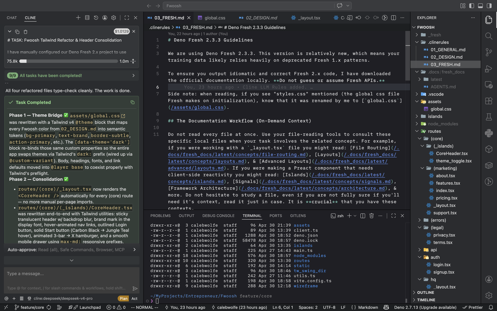

# Caleb Wolfe
 (Senior)

 

**Software Engineering student at BYU-Idaho**

Hi! My name is Caleb! Thanks for visiting =). This page used to be huge & broke down all of my interests & professional pursuits. I thought it was about time to clean it up a little, & perhaps focus it's content. I'm a senior at BYU–Idaho & I'm set to graduate at the end of this year (2026). 

Right now, I'm focusing on starting my own saas company; I've been trying to become a successful '_solopreneur_.' I also am deeply interested in the field of Programming Language Research & compiler/interpreter design & implementation. I'm going through Bob Nystrom's "**Crafting Interpreters**," & it's been an incredible read. 

Additionally, I'm fascinated by AI. I use it to enhance my development speed & enjoyment. I'm a big user of  & I'm constantly finding new ways AI can boost my productivity. I would love to work in AI research as well. I'm also interested in Game Development. It's an interest I don't often have time to fully sink my teeth into, but it's there.

## Current Focuses

Here are my main focuses & passions along with some current projects or focuses. Take a look! 

### Project Management 📈

This is my _professional_ focus. I believe that in the work force, it is in these positions that I'll thrive & do my best work. I learned this by actually being a project manager for the BYU–Idaho Support Center. I loved the work & enjoy working with a team to reach project milestones & deadlines.

- Pursing a [**Certified Associate in Project Management (CAPM)**](https://www.pmi.org/certifications/certified-associate-capm?utm_job_number=16&utm_region_name=north_america&utm_funnel_stage=customer_acquisition&utm_marketing_channel=paid_media&utm_marketing_subchannel=display_prospecting&utm_start_date=09122024&utm_end_date=12312026&utm_source=google&utm_custom_field_one=capm_pmax_certification_north_america_display&utm_custom_field_two=none&utm_custom_field_three=none&utm_custom_field_four=none&utm_custom_field_five=none&s_kwcid=AL!8620!3!!!!x!!&gad_source=1&gad_campaignid=21719119157&gclid=Cj0KCQjwj47OBhCmARIsAF5wUEF94HoJFlbSfganPmZpT-xz_evFuZUjbQqmOzyI1qDFDQdaKPKrM54aArnwEALw_wcB) 
  - Self-studied using "[CAPM Certified Associate in Project Management All-in-One Exam Guide](https://www.barnesandnoble.com/w/capm-certified-associate-in-project-management-all-in-one-exam-guide-james-lee-haner/1142770685)," by James Lee Haner

### Programming Languages

This has been a very new & exciting interest of mine. I've always been super interest in PL research & compiles & interpreters. This semester at BYU–Idaho, I've finally taken the leap & I'm now working on making my own language. Check it out, it's called [Mimir](https://github.com/caleb-wo/Mimir). 

I've loved learning more about this & I'm trying to think of ways to break to the professional work of PL research & design.

### Solopreneur 👨‍💻

I have a lot of ideas. This semester I'm finally taking a the leap to implement one of them to try & make my own money. I'm working on a product called "**Fwoosh**." It's not live yet, but when it is, it'll be at [fwoosh.me](/). It's aim is to be a faster & simpler alternative to Linktree. For this project, I'm using the Deno ecosystem. It's my favorite for server-side JS/TS & it perfectly fits my need for edge compute. 

I've been developing this project with VS Code alongside Cline. I treat my AI partner as the Lead Designer. While I handle the main _business_ code, AI handles all the frontend & styling. I love this work flow & it's been helping me move really fast. It's been a masterclass in managing scope & utilizing AI [rules](https://docs.cline.bot/customization/cline-rules) & [skills](https://docs.cline.bot/customization/skills). I've really happy with how many times my agent gets a task done right the first time.

Tooling being used:

-   **Deno:** 
    -   **Fresh:** 
    -   **Deno Deploy:** 
    -   **Deno KV:** 
-   **TypeScript:** 
-   **Cline:** 

### Artificial Intelligence

Right now, I'm hyperfixated on . I really do enjoy having an AI accomplice—so to speak. It's such an addicting workflow & it feels like I'm a technical project manager leading the project & directing AI assistants. In fact, here's a screenshot of what my current work space looks like. It's from my current project Fwoosh:

# Coding Proficiencies

### Tier 1 🏅

These are languages that I enjoy coding in most & am often working with.

- TypeScript/JavaScript
- Odin
- Lua & Luau

### Tier 2 🥈

These are languages that I've done work with _in the past_, so I'm rusty. That said, I'm confident enough that if I needed to re-learn or reacquaint myself, I'd be able to in just a few hours.

- C
- Java
- C#
- Python
- Haxe

### Tier 3 🥉

These are programming languages that I'd love to learn. Some, I already have plans to learn!

- Rust
- OCaml
- Haskell
- LLVM IR
